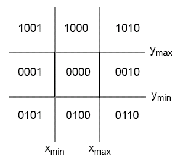
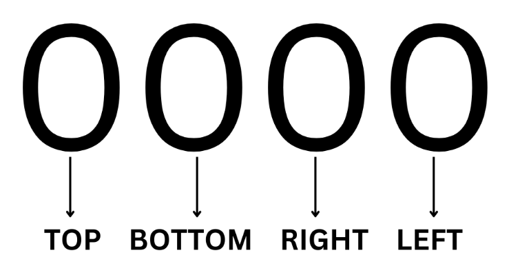

# Cohen Sutherland's Line Clipping Algorithm 
* The Cohen–Sutherland algorithm is a line clipping algorithm used in computer graphics. After dividing a 2D space into 9 regions, the algorithm effectively identifies the lines and line segments that are visible in the viewport, which is the center region of interest.
* The division of regions is based on a window defined by its maximum (xmax, ymax) and minimum (xmin, ymin) coordinates. One region represents the window itself, while the other 8 regions surround it, identified using a 4-digit binary code.

### Region Codes Assignment

* Each endpoint of a line segment is assigned a 4-bit binary region code based on its position relative to the clipping window:
  * Bit-1 (Top): 1 if y > ymax , 0 otherwise.
  * Bit-2 (Bottom): 1 if y < ymin , 0 otherwise.
  * Bit-3 (Right): 1 if x > xmax , 0 otherwise.
  * Bit-4 (Left): 1 if x < xmin , 0 otherwise.
  

  For example:
  * If a point (x, y) lies in top-right of the clipping window, its region code will be 1010.

 

**Trivial Acceptance and Rejection**:
- If both endpoints have a region code of `0000`, the line segment is completely inside the clipping window and can be accepted.
- If the bitwise AND of both codes is not `0000`, the line segment is completely outside and can be rejected.

### Line Clipping Algorithm Pseudo Code

1. Assign region codes to both endpoints points (A(x1, y1) and B(x2, y2)) of the line segment.

2. Perform a bitwise OR operation on both endpoints:
   - If OR == 0000,
     - The line is completely inside the window (Trivially accepted).
   - Else,
     - Perform a bitwise AND operation on both endpoints:
       - If AND != 0000,
         - The line is not inside the window, it cannot be clipped (Trivially rejected).
       - Else,
         - The line is partially inside the window and can be considered for clipping.

3. After confirming the line is partially inside the window:
   - Find the intersection with the boundary of the window:
     - Calculate the slope of the line: m = (y2 - y1) / (x2 - x1).
     - Determine the intersection point based on the region code: 
       - **If the line intersects with the top boundary**:
         - x = x1 + (1 / m) * (ymax - y1)
         - Update the intersection point (x, ymax)
       - **If the line intersects with the bottom boundary**:
         - x = x1 + (1 / m) * (ymin - y1)
         - Update the intersection point (x, ymin)
       - **If the line intersects with the left boundary**:
         - y = y1 + m * (xmin - x1)
         - Update the intersection point (xmin, y)
       - **If the line intersects with the right boundary**:
         - y = y1 + m * (xmax - x1)
         - Update the intersection point (xmax, y)

         
4. Overwrite the endpoint with the new intersection point and update its region code.

5. Repeat step 2-4 until a trivial accept or reject occurs.

6. Repeat the entire process for other lines as needed.

 

* This pseudo code outlines the steps of the Cohen–Sutherland line clipping algorithm, detailing how line segments are processed and clipped against a defined clipping window in 2D space.
