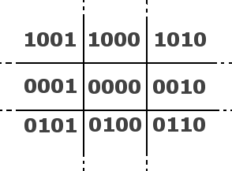

**Cohen Sutherland's Line Clipping Algorithm**  

Pseudo Code of the algorithm  
Input : Two Endpoints of the line, (x0, y0) & (x1, y1).  
Two opposite corner points of the frame buffer.  

**Steps of the Algorithm**  

 1. P0 = (x0, y0) & P1(x1, y1)  
 2. Compute the 4-bit codes for each endpoint.  
 The codes of the vertices are computed from the below figure :     

  

  Source : From Academic Tutorials

  0000 represents the clip window and all other areas outside are to be clipped.  
 
  If both codes are 0000,(bitwise OR of the codes yields 0000 ) line lies completely inside the window: pass the endpoints to the draw routine.  
  If both codes have a 1 in the same bit position (bitwise AND of the codes is not 0000), the line lies outside the window. It can be trivially rejected.    
 3. If a line cannot be trivially accepted or rejected, at least one of the two endpoints must lie outside the window and the line segment crosses a window edge. This line must be clipped at the window edge before being passed to the drawing routine.  
 4. Examine one of the endpoints, say P0 and read  P0's 4-bit code in order: Left-to-Right, Bottom-to-Top.  
 5. When a set bit (1) is found, compute the intersection I of the corresponding window edge with the line from P0 to P1. Replace P0 with I and repeat the algorithm.  

